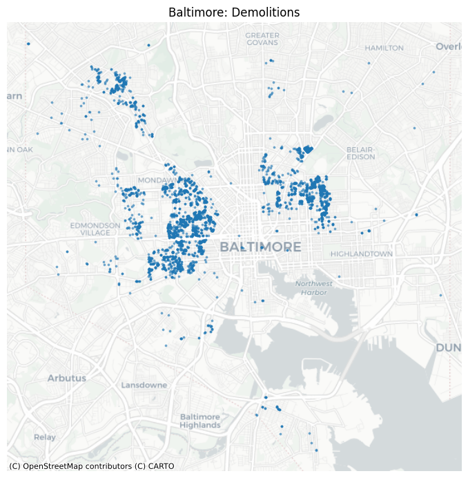

# construction_and_demolition_detection

By Samuel Alter

## Overview

Building on the work from the [Low-Resolution Satellite Imagery Change Detection](#) project, we train a model to detect construction and demolition in an integrated satellite and street-view image pipeline.

## Data Sources

### Blight and Demolitions

Baltimore Monthly Demolitions:

Detroit Monthly Blight Violations:

Detroit Monthly Commercial Demolitions:

Detroit Monthly Residential Demolitions:

### Street View

Demolition in Baltimore Example:  

